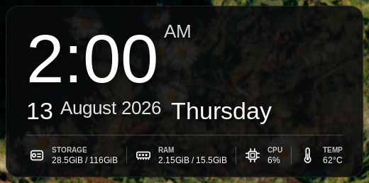
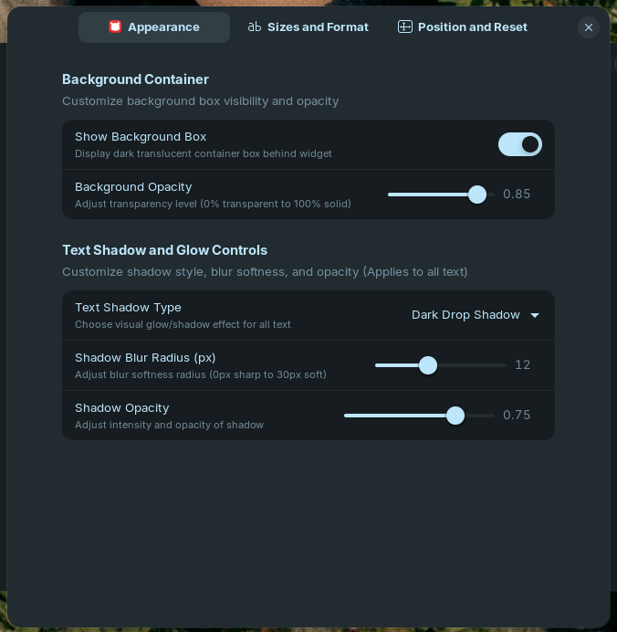

# 🌟 DeskGlow - Glassmorphic Desktop Clock & System Resource Monitor

[](https://gnome.org)
[](https://zorin.com/os)
[](LICENSE)
[](https://gtk.org)

**DeskGlow** is a sleek, modern, glassmorphic desktop clock widget and real-time system resource monitor designed specifically for **Zorin OS 17/18** and **GNOME Shell 45, 46, and 47**. Inspired by Rainmeter and modern desktop widgets, it offers rich customization, interactive drag-and-drop, crisp typography, and live performance statistics — sitting elegantly on your desktop wallpaper behind open windows.

*Zorin OS এবং GNOME Shell (45/46/47) এর জন্য তৈরি একটি প্রিমিয়াম গ্লাসমরফিক ডেসটপ ক্লক এবং রিয়েল-টাইম সিস্টেম রিসোর্স মনিটর এক্সটেনশন।*

---

## 📸 Preview / স্ক্রিনশট

| Desktop Clock Widget | Extension Preferences (GTK4 / Libadwaita) |
| :---: | :---: |
|  |  |

*(Place your preview screenshot image in `assets/preview.png` and settings screenshot in `assets/settings.png`)*

---

## 🌟 Key Features / সুবিধাসমূহ

### 🕒 Clock & Date Display
- **Digital Clock**: 12-hour or 24-hour time format with optional live seconds indicator and AM/PM label.
- **Full Date Display**: Clean presentation showing Day Number, Month, Year, and Day of the Week.

### 📊 Live System Resource Monitoring
- 💾 **Storage Monitor**: Real-time display of used vs total disk space in GiB (e.g. `88.6GiB / 116GiB`).
- 🧠 **RAM Monitor**: Live RAM consumption vs total memory (e.g. `4.81GiB / 15.5GiB`).
- ⚡ **CPU Load**: Live processor usage percentage (`%`).
- 🌡️ **CPU Temperature**: Live core processor thermal readout in °C (`61°C`).
- 📏 **Tall Vertical Line Dividers**: Clean 1px white line separators between stats matching premium widget designs.

### 🖱️ Interactive Desktop Drag & Drop
- **Mouse Dragting**: Left-click and drag the widget anywhere on your desktop screen. Coordinates are saved across system reboots!
- **Desktop Layering (Behind Windows)**: Positioned strictly on the desktop background layer so open application windows (browsers, terminals, settings) cover it naturally.
- **Position Lock Toggle**: Lock position from preferences to prevent accidental mouse dragging.
- **Screen Position Presets**: Quick align buttons for *Bottom Right*, *Bottom Left*, *Top Right*, *Top Left*, and *Center*.

### 🎨 Glassmorphism & Visual Customization
- **Background Box & Opacity Controls**: Toggle dark translucent background container ON/OFF and adjust opacity from 0% (transparent) to 100% (solid).
- **Advanced Text Shadow & Glow Controls**:
  - *Outer White Glow* (Neon halo glow around text)
  - *Dark Drop Shadow* (Deep contrast drop shadow for bright wallpapers)
  - *Crisp Outline* (Subtle 1px border shadow)
  - *Off / None* (Sharp unshadowed text)
  - Customizable *Blur Radius* (0px to 30px) & *Shadow Opacity* (0.0 to 1.0).
- **Individual Component Resizing**: Independent font size sliders for Clock Time, Date Text, Stats Values, and SVG Icon sizes!

### ⚙️ Tabbed Preferences Window (Libadwaita / GTK4)
- **Organized Tab Navigation**:
  - 🎨 **Appearance Tab**: Background container, opacity, and text shadow/glow controls.
  - 📏 **Sizes & Format Tab**: Component font & icon sliders, 24-hour format & seconds toggle.
  - 📍 **Position & Reset Tab**: Coordinates X/Y, Drag Lock, Screen Location Presets, and **One-Click Reset to Default Settings**.

---

## 💻 System Requirements / প্রয়োজনীয় শর্তাবলী

- **Operating System**: Zorin OS 17 / 18, Ubuntu 24.04 LTS, Arch Linux, Fedora, or any Linux distribution running GNOME.
- **GNOME Shell Version**: `45`, `46`, or `47`.
- **Dependencies**: `glib2`, `gjs`, `gnome-shell`, `python3` (pre-installed on Zorin OS / Ubuntu).

---

## 🚀 Installation Guide / ইন্সটলেশন টিউটোরিয়াল

### Method 1: Automatic Installation (Recommended)

1. **Clone or Download the Repository:**
   ```bash
   git clone https://github.com/your-username/deskglow.git
   cd deskglow
   ```

2. **Run the Installer Script:**
   ```bash
   chmod +x install.sh
   ./install.sh
   ```

3. **Reload GNOME Shell:**
   - **Wayland (Zorin OS / Ubuntu default)**: Log out and log back in (or Lock and Unlock your desktop).
   - **X11**: Press `Alt + F2`, type `r` and press `Enter`.

---

### Method 2: Manual Installation

1. Compile the GSettings schema and copy to local schema path:
   ```bash
   glib-compile-schemas schemas/
   mkdir -p ~/.local/share/glib-2.0/schemas
   cp schemas/org.gnome.shell.extensions.deskglow.gschema.xml ~/.local/share/glib-2.0/schemas/
   glib-compile-schemas ~/.local/share/glib-2.0/schemas/
   ```

2. Create the target GNOME extension directory:
   ```bash
   mkdir -p ~/.local/share/gnome-shell/extensions/deskglow@zorin-extension
   ```

3. Copy extension files into place:
   ```bash
   cp -r metadata.json extension.js sysinfo.js stylesheet.css prefs.js schemas icons ~/.local/share/gnome-shell/extensions/deskglow@zorin-extension/
   ```

4. Enable the extension:
   ```bash
   gnome-extensions enable deskglow@zorin-extension
   ```

---

## ⚙️ Extension Preferences / সেটিংস কনফিগারেশন

To open preferences window:
- Launch **Extension Manager** or **GNOME Extensions** app.
- Click the **Settings (gear icon)** next to **DeskGlow**.
- Or run via terminal:
  ```bash
  gnome-extensions prefs deskglow@zorin-extension
  ```

---

## 🛠️ Project Structure / প্রজেক্ট স্ট্রাকচার

```
DeskGlow/
├── metadata.json         # Extension metadata & GNOME compatibility
├── extension.js          # Core widget UI, desktop layering & drag logic
├── sysinfo.js            # Non-blocking system getters (Storage, RAM, CPU, Temp)
├── stylesheet.css        # Glassmorphic CSS styling & vertical line dividers
├── prefs.js              # Tabbed Preferences Window (Libadwaita / GTK4)
├── install.sh            # One-click installation & schema compiler script
├── schemas/              # GSettings XML schema & compiled schema files
├── icons/                # Vector SVG icons (Storage, RAM, CPU, Temp)
└── assets/               # Screenshots and preview images for README
```

---

## 🏷️ GitHub Topics & SEO Keywords (For Repository Settings)

Add these topics to your GitHub repository to increase search ranking:

`gnome-extension` • `zorin-os` • `desktop-clock` • `system-monitor` • `rainmeter-alternative` • `conky-alternative` • `glassmorphism` • `gtk4` • `libadwaita` • `linux-desktop-widget` • `ubuntu-widget`

---

## 👤 Author & Developer / ডেভেলপার

**MD. Tanvir Ahamed Siddike**

- **GitHub**: [github.com/tanvirahamed](https://github.com/)
- **Project Repository**: DeskGlow GNOME Extension

---

## 📜 License

This project is licensed under the [MIT License](LICENSE). Feel free to use, modify, and share!

⭐ **If you find DeskGlow useful, please consider giving this repository a star on GitHub!**
